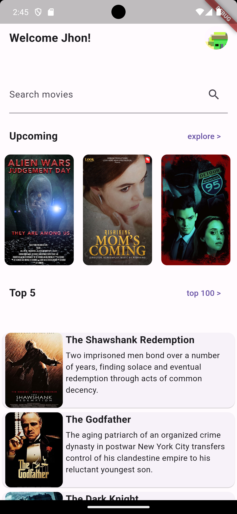

# CineCritique

CineCritique is an Android app developed as my final project for CSCI 467 and CSU Chico. This app allows users to discover top movie details, search for movies, like or dislike them, and watch trailers. 

## Features

- **Top Movie Details**: View details of top movies.
- **Movie Search**: Search for movies and retrieve detailed information.
- **User Interaction**: Like or dislike movies.
- **Watch Trailers**: Watch trailers of the movies.

## APIs Used

1. **API 1**: Used to search for movies.
2. **API 2**: Used to retrieve movie details.

## Authentication

- **Google Firebase Authentication**: Used to create and log users.

## Database and Storage

- **Google Firebase Database**: Used to store and access user data.
- **Google Firebase Storage**: Used to hold and manage user data.

## Getting Started

To get started with CineCritique, follow these steps to install the APK:

1. Download the APK file CineCritique from the respiratory.
2. Transfer the APK file to your Android device.
3. On your Android device, navigate to the APK file location using a file manager.
4. Tap the APK file to begin the installation.
5. If prompted, enable the option to install apps from unknown sources.
6. Follow the on-screen instructions to complete the installation.

## Screenshots

## Contributions

Contributions are welcome! Please create a pull request or open an issue for any improvements or bugs you find.

## License

This project is licensed under the MIT License.

